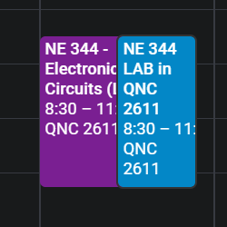

# google-calendar-nuker

## Introduction

This repository includes a firebase project for nuking all calendar events in a set time period. Intended to be deployed to firebase.

## Scope

For now, this project is intended for one-time personal use only.

## Motivation

So I used UWaterloo [Quest Schedule Exporter](https://schedule.uwaterloo.xyz/) to export my class calendar and imported that onto Google Calendar 1 day before the term officially started. So far so good, all is happy. Then the next day portal calendar showed up.

I'm not a fan of seeing two identical events side by side. Nor do I enjoy deleting events one by one.

Well to be fair `Google Calendars` does have the neat functionalities to delete subsequent event. After I nuked those _series_ of events there were still 4 to 5 unique events each week that need to be nuked individually. I had my attempt in doing that, nuking 3 weeks worth of things by clicking manually and I'm done with it. I need to write something to nuke it.
